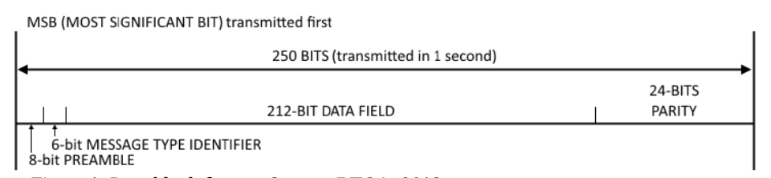
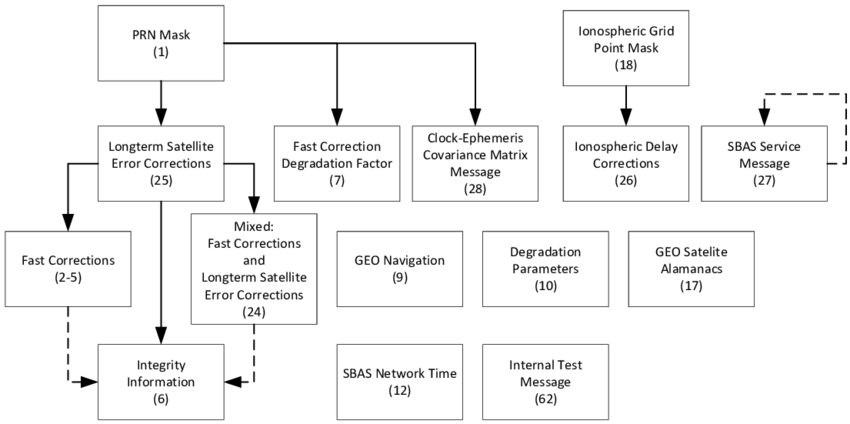

# Disclaimer

This project is the result of curiosity and desire to learn and share. As part of this process I make use of Github as a repository for reference and future evolutions or even forks.
All the information used to develop the ideas presented here has been extracted from public websites, documents and applications. I will try to reference all of them. But please take into account that as the Internet is a living creature I can't garantee that all the links will work correctly. They could be removed from the corresponding servers or linked to a different resource.
If you use ideas or code from this repository, you will do it at your own risk. In no case will the correct operation or technical support be guaranteed.
If you detect any issue or error in what here is expossed, please feel free to contact. I'll appreciate it.

Take also into account the ESA disclaimer:


http://www.egnos-pro.esa.int/sisnet/disclaimer.html

# Introduction to SisNet

Every satellite-based wide area augmentation system, as the European system EGNOS, provides ranging signals transmitted by GEO satellites, differential corrections on the wide area and additional parameters aimed to guarantee the integrity of the GNSS user.

SisNet is the combination of those *Satellite Navigation* messages and internet. And EGNOS is the European Geostationary Navigation Overlay Service. It takes GPS signal and generates a SIS (Signal in Space) through Geostationary satellites. This Signal contains Satellite Navigation messages that allow users to improve the existing GPS data. Thanks to SISNet this signal is available also in real time via internet.

In order to use connections against the SISNet server you will need a SISNet user account.

A SISNeT account consists of the following information:

- IP address of the SISNeT Data Server
- Port to which you connect
- User Login information (username/password)

# References

Don't be lazy ... Check them all!

- http://www.egnos-pro.esa.int/sisnet/index.html
- http://www.egnos-pro.esa.int/sisnet/news3.html
- http://www.egnos-pro.esa.int/Publications/SISNET/SISNET_UID_3_1.pdf
- https://egnos-user-support.essp-sas.eu/new_egnos_ops/
- https://gssc.esa.int/navipedia/index.php/The_EGNOS
- https://gssc.esa.int/navipedia/index.php/The_EGNOS_SBAS_Message_Format_Explained
- https://gage.upc.edu/

# EGNOS messages

SISNet provides access to the different Egnos messages through The Internet.

The bits of the Egnos message are organized this way:



Wa have:

|Number of bits|Bits position|Name        |Purpose                              |
|--------------|-------------|------------|-------------------------------------|
|8             |0-7          |Preamble    |Frame synchronisation                |
|6             |8-13         |Message type|Definition of message type           |
|212           |14-225       |Data        |Integrity and Corrections data       |
|24            |226-249      |Parity information |CRC-24Q redundancy and error checking|

There are different types of messages related as follows:



The following table summarises the messages and their types:

**Satellite information messages**

|Type | Content|
|-----|--------|
| 1 | PRN mask assignments, set up to 51 of 210 possible |
|2-5| Fast corrections |
| 6 | Integrity information  |
| 7 | Fast correction degradation factor |
| 9 | Geo Navigation message (X,Y,Z, time, etc.) |
|17 | Geo satellite almanacs |
|24 | Mixed fast corrections/long term satellite error corrections |
|25 | Long term satellite error corrections |
|28 | Clock Ephemeris Covariance Matrix message |

**Message type 1: PRN Mask assignments**<br>
This message has 210 ordered slots. Each one corresponds to a given satellite PRN and constellation. Each slot is one bit, meaning:
* 1 = The satellite is monitored
* 0 = The satellite is not monitored

This set of *ordered* slots is called the *PRN mask*. The order is important because the order of the monitored satellites in the mask will be the order in which the corrections will be sent in other messages. Currently, the slots are assigned this way:
* Slots 1-37: GPS satellites
* Slots 38-61: GLONASS satellites (Glonass PRN +37)
* Slots 62-119: Future GNSS
* Slots 120-138: GEO/SBAS satellites
* Slots 139-210: Future GNSS/GEO/SBAS satellites

**Samples of Satellite information messages**

|Type | Sample |
|-----|--------|
|1|9A07FF7FFFBC00000000000000000000008004000000000000000000E791BF40|
|3|530DFFE4003FF3FFBFD4000008003FEC000000000001797979B997BBA31765C0|
|6|9A189FBBB97B97BDD55795997B95BBBB97BBBBBBBBBBBBBBBBBBBBBB84B91080|
|7|9A1CF3FFFFFFFFFFFFFFFFFFFFFFFFFFFFFFFC00000000000000000037565480|
|9|C62456193ED63F1B620D92C0C000000000000000000000000000000032433880|
|17|9A447B116C02847C000011022FC6C2C280000000000000000000010C8E2F9640|
|24|C66000000C000000000003BBBBBB80027800000000540B3F3FA027FBB4C33400|
|25|C66409E0000000021312FB81C05FE61A8C0302800027077F204FB7F99D867540|
|28|5360000000003FFC000003BB97BB902D69FBFB7C801198BEDFF14FFFBE49F280|

**Ionospheric information messages**

|Type | Content|
|-----|--------|
|18 |Ionospheric grid points masks|
|26 | Ionospheric delay corrections |

Samples:

|Type | Sample |
|-----|--------|
|18|9A494C000000000000400001F00003F80003FC0003FE0001FF0001FFAE399980|
|26|C6690C10E087043821FFDFFEF05F02A412E087043821C0EFFEFFF780068C0240|

**Other messages**

|Type | Content|
|-----|--------|
|0|Don’t use for safety applications|
|10|Degradation parameters|
|12|SBAS Network time / UTC offset parameters|
|27|SBAS Service message|
|62|Internal test message|
|63|Null message|

Samples:

|Type | Sample |
|-----|--------|
|0 |C608C00BFC4000000003FF4000000003FF3FF7FD00299FBBBBBB9557902BAFC0|
|10|5328002CC9C3C3BE78589903C0148CB00000000000000000000000003CA3EA80|
|12|C6300015A0000000304A084A241C49891D81040000000000000000001204D900|
|27|C66C0040F48EC0A0A200000000000000000000000000000000000000109715C0|
|62|C608C00BFC4000000003FF4000000003FF3FF7FD00299FBBBBBB9557902BAFC0|
|63|C608C00BFC4000000003FF4000000003FF3FF7FD00299FBBBBBB9557902BAFC0|

**SBAS L5 Messages**

|Type | Sample |
|-----|--------|
|31|Satellite Mask|
|34,35,36|Integrity message|
|32|Clock-Ephemeris Corrections and Covariance Matrix|
|39/40|SBAS Broadcasting Satellites Ephemeris and Covariance Matrix|
|37|Degradation Parameters and DREI Scale Table|
|47|SBAS broadcasting Satellite Almanac|

Samples:

|Type | Sample |
|-----|--------|
|31|C660000000003FFC000003BB9BBB8016C4030703C04390BFBFAFC8079D9A34C0|
|34,25,36|9A60000000003FFC000003BB9BBBA016C4030703C04390BFBFAFC80792CEF380|
|32|C60CFFDC003FF8003FF800000000001BFF3FE000000179797BB9557B987AA3C0|
|39/40|5309C007FB4000000003FEC000000003FFBFF7FD0025DBBBBBBB995B939C6200|
|37|9A690BFDFFEF17704340F0087043821C12E077FF7FFBC1DC07A04380176693C0|
|47|9A690BFDFFEF17704340F0087043821C12E077FF7FFBC1DC07A04380176693C0|


# SisNet as a Python package

This *sisnet* you have here is a python implementation. Includes built-in utilities that will allow you to investigate and understand better the SisNet protocol. The functionalities implemented are:

- Sinca compression algorithm. A technical description and implementation of the SINCA compression algorithm. We need this to understand the information contained in the response messages (\*MSG).

- Module for ds2dc protocol and communication with the *DS* (Data server). A technical description of DS2DC protocol, including the fundamental theory and the available DS2DC messages. This module will allow us to sent and receive messages to the *DS*. You can use this mode as an independient executable script or as a module for your own project.

## Install

- Copy the *sisnet* folder to a new folder in your system, for example:
```console
	git clone https://github.com/jonatanmv/sisnet.git

	cp -R sisnet $HOME/bin/
```
- After this you will have "$HOME/bin/sisnet/sisnet/*" with the python modules there
- Add the new folder to the python path. You can do it using the *PYTHONPATH* enviroment variable:

	- Using the *PYTHONPATH* enviroment variable.
	```console
	echo 'export PYTHONPATH="${PYTHONPATH}:$HOME/bin/sisnet"' >> $HOME/.bash_profile
	```

	- Remember to install the required dependences
	```console
	pip install -r requirements.txt
	```

- Set up your configuration file "sisnet.conf" (explained in next section)

- Use the sisnet package in your own program or from the python console.

## Configure

Create a folder for your application and put inside a "sisnet.conf". The most simple config file would be one like this:

```console
[GLOBAL]
server = server_address
username = your_username
password = your_password

[PRN123]
port = port_for_prn_123

[PRN126]
port = port_for_prn_123

[PRN136]
port = port_for_prn_123
```

In case you need a specific server for one of the PRN then you can add it into that PRN section, for example:

```console
[GLOBAL]
prn = 123
server = server_ip_address
username = your_username
password = your_password

[PRN123]
port = port_for_prn_123

[PRN126]
server = server_address_for_prn_126
port = port_for_prn_123

[PRN136]
port = port_for_prn_123
```

If you need to get credentials and connection details for your own config file, please check this website:

http://www.egnos-pro.esa.int/sisnet/contact.html

## Using sisnet.ds2dc as a script... Lets try it !

```console
usage: ds2dc.py [-h] [-c CONFIG_FILE] [-p PRN] [-r REQUEST] [-v]

optional arguments:
  -h, --help            show this help message and exit
  -c CONFIG_FILE, --config-file CONFIG_FILE
                        Configuration file. By default will be 'sisnet.conf'.
                        Check more details on the documentation
                        https://github.com/jonatanmv/sisnet#configuration
  -p PRN, --prn PRN     GEO PRN to use. By default the one configured in the
                        sisnet.conf file.
  -r REQUEST, --request REQUEST
                        Request message to be sent to the EGNOS SisNet server.
                        Available messages: MSG, GETMSG, GPS_IONO, START,
                        STOP. Check documentacion for details.
  -v, --verbose         Output detailed log info
```


## Using sisnet.ds2dc as a module... Lets try it !

Here you have some code using sisnet as a point of start. Try it !

You can use the modules as a base to create your own python application.

```python
#!/usr/bin/env python

import logging

from sisnet import ds2dc

log=logging.getLogger(__name__)    
log.info('Creating and loging clients agains DS...')

prn123=ds2dc.client()
prn123.login()
# You can override all parameters (prn,username,password,ip,port)
# from config.ini file passing them as parameters.
prn136=ds2dc.client(config_file="my_sisnet.conf", prn=136)
prn136.login()

# Some request to the DS (Data Server)
log.info('Testing SISNET R_Messages from UAS to DS and getting Answers...')
answer=prn123.request("MSG")
prn123.decompress_egnos_message(answer)
prn136.decompress_egnos_message(prn136.request("MSG"))
prn123.request("GPS_IONO")

```

## Using sisnet.ds2dc as a standalone script ... Lets try it !
First take a look to the script mode help:

```console
python sisnet/ds2dc.py --help

usage: ds2dc.py [-h] [-c CONFIG_FILE] [-d DECODE] [-p PRN] [-r REQUEST] [-v]

optional arguments:
  -h, --help            show this help message and exit
  -c CONFIG_FILE, --config-file CONFIG_FILE
                        Configuration file. By default will be 'sisnet.conf'.
                        Check more details on the documentation
                        https://github.com/jonatanmv/sisnet#configuration
  -d DECODE, --decode DECODE
                        Decode the data section (212 bits) of a Egnos message
                        in hexadecimal.
  -p PRN, --prn PRN     GEO PRN to use. By default the one configured in the
                        sisnet.conf file.
  -r REQUEST, --request REQUEST
                        Request message to be sent to the EGNOS SisNet server.
                        Available messages: MSG, GETMSG, GPS_IONO, START,
                        STOP. Check documentacion for details.
  -v, --verbose         Output detailed log info


```

## Messages from the DS2DC protocol

Lets take a look first to some message samples...

```console
Request to SisNet: MSG

Answer from SisNet: *MSG,1170,560888,9A6A43FDFFEFFF7FFBFFDE0AD06E83601B20E8074035C1AE0E707B803569CCC0*48

Answer analisys:

{'gps_week': '1170', 'gps_time': '560888',
 'egnos_msg_hex_compressed': '9A6A43FDFFEFFF7FFBFFDE0AD06E83601B20E8074035C1AE0E707B803569CCC0*48',
 'egnos_msg_hex': '9A6A43FDFFEFFF7FFBFFDE0AD06E83601B20E8074035C1AE0E707B803569CCC0',
 'message_preamble': '10011010',
 'message_type_int': 26,
 'message_data': '10010000111111110111111111111011111111111101111111111110111111111111011110000010101101000001101110100000110110000000011011001000001110100000000111010000000011010111000001101011100000111001110000011110111000000000',
 'message_parity': '110101011010011100110011',
 'message_excess': '00000'}

```

Other responses:

```console

Answer from SisNet: *MSG,1170,561019,5308BFFC0|83FF3FE0|CBFEBFD000D7BB9FBBB9955542A8B00*35

SiSNet answer analisys:

{'gps_week': '1170', 'gps_time': '561019',
 'egnos_msg_hex_compressed': '5308BFFC0|83FF3FE0|CBFEBFD000D7BB9FBBB9955542A8B00*35',
 'egnos_msg_hex': '5308BFFC000000003FF3FE000000000000BFEBFD000D7BB9FBBB9955542A8B00',
 'message_preamble': '10100110',
 'message_type_int': 4,
 'message_data': '01011111111111100000000000000000000000000000000000011111111110011111111100000000000000000000000000000000000000000000000001011111111101011111111010000000000001101011110111011100111111011101110111001100101010101010',
 'message_parity': '101000010101010001011000',
 'message_excess': '00000'}

```

```console
*GPS_IONO, 6.519000000000E-09, 2.235000000000E-08,-5.960000000000E-08,-1.192000000000E-07, 8.602000000000E+04, 9.830000000000E+04,-6.554000000000E+04,-5.243000000000E+05
```

We have two types of messages:

- *R-Messages* **Request** Messages
- *S-Messages* **Service** Messages. Can be:
	- sent as response to a *R-Message*
	- or spontaneously sent by the *DS*

And here you have in the following table the description of the different messages supported by the EDAS SISNeT Service and implemented here:

| Message | Type | Description | Samples |
|---------|------|-------------|---------|
| AUTH | R | Request authentication (1)| AUTH,*username*,*password* <br> AUTH,*username*,*password*,q (1)|
| \*AUTH | S | Service response when login is ok <br> If user is not authorised, an \*ERR message will be sent (error code 2)| \*AUTH <br> \*ERR,2,Access Denied |
| MSG | R | Request for the most recent EGNOS Message (2) | MSG |
| \*MSG | S | \*MSG provides the last EGNOS Message | (3) |
| GETMSG | R | Request for an SBAS message already broadcas by EGNOS. (4)| GETMSG,1,1|
| *GETMSG | S | Inmediate answer to a GETMSG Request | (4)|

(1) The 'q' is optional and can be used to initialise the receiver. E-SISNeT service will return \*AUTH followed by the last EGNOS message of each type (MT1–MT63)

(2) Synchronous message. In real life loss of messages could appear. The DS2DC protocol offers the possibility  to retrieve an already sent EGNOS message. You will use the *GETMSG* request message for that.

(3) \*MSG,1049,123146,9A113FCC0|A10/181FBB97B80|7F35A40\*39


**Take into account that the GPS week is represented using 10 bits. So we have a range from	0 to 1023. After this maximum value is reached, the week number "rolls over" zero. So this *rollover* effect has to be considered by developers when processing week numbers.**

The GPS uses its own timescale, the "GPS time". The GPS satellites transmit the time information in two parts: The week number (number if weeks since time zero taking into account the rollover efect) and the elapsed number of seconds within that week.
With the GPS starting (time zero) on the 6 January 1980, the first reset of the 1024 weeks counter happened on 21 August 1999, ending the initial GPS Time Epoch. The next reset of the week counter from 1023 to zero will be on Saturday 6 April 2019, at 23:59:42 UTC (note that there is currently an 18-second gap between UTC Time and GPS Time), ending the second GPS Time Epoch.

When does the rollover happen?

GPS Start: January 6, 1980

First rollover: Midnight of 21-22 August 1999.

In May 2006 (first rollover already crossed), if the UAS receives a week number of 78, this means the real week is 78+1024=1102.

Second rollover: Midnight (GPS time) of 6-7 April 2019 = 23:59:42 UTC on 6 April 2019 or 01:59:42 CEST on Sunday 7 April 2019.

Third rollover: November 20, 2038

(4) The SisNet Data Server determines the length of the historical archive. The *DS* (Data server) configuration determines the length of the historical archive. As a rule, the *DS* will try to make available the latest 30 messages of each type.


*Message type:* The message type number corresponding to the SBAS message to receive.

*Order of occurrence:* A value of "1" means the last occurrence of selected message type, and so on. Say the ESTB broadcast *MT1* at time *t1*, and next time it broadcast *MT1* is at time *t2*. Then, "*GETMSG,1,1*" will return *MT1* broadcasted at *t2*, while "*GETMSG,1,2*" will return *MT1* broadcasted at *t1*.


*Request sample:* \*GETMSG,1,2

*Response sample:* \*GETMSG,1154,56340,C607FF7FFFBC0/1680040/12F34ADEC0*21

*Egnos message decoded:* C607FF7FFFBC00000000000000000000008004000000000000000000F34ADEC0


## sisnet.sinca (the compression algorithm) ... Lets try it !

sinca is the compression algorithm used in EGNOS in order to optimize the size of EGNOS messages. The EGNOS messages are received in a sinca compressed format from SisNet and they also include a checksum. Within the sinca module you will be able to decompress those EGNOS message and also calculate the checksum of decompresses messages. But this is more like an internat functioanlity used by the *ds2dc* module. The sinca available functions are:

- sisnet.sinca.decompress()
Decompress an message (for example an Egnos message) compressed with the sinca protocol

- sisnet.sinca.checksum()
Calculates the checksum for a decompressed message. The checksum is initially included in the compressed version of the message, so you will be able to check it. The Checksum is to be computed on the message bits and verified with the last 2 hexadecimal digits. The message is terminated by an asterisk "*" symbol, followed by two hexadecimal digits constituting a checksum (XOR operation of the bytes forming the EGNOS message). i.e. if B1, B2 .... B64 are the 64 bytes of the EGNOS message then checksum = B1B2 ^ B3B4 ^ B5B6 ^ ... ^ B61B62 ^ B63B64.

They are based on the SINCA compression algorithm:


In the samples folder you will find a script that demonstrates the use of the sinca module.

The script is "sinca_message_compression_samples.py"

And you will get something like this as result:

```console
Testing SINCA module
Decompressing a message...
Compressed   message = 9A127FF40|53FCBFFC0/1717BB97B80|51F44C380*9F
Decompressed message = 9A127FF4000003FCBFFC0000000000000000000000017BB97B8000001F44C380 (checksum=9F)
Compressing message...
Decompressed message = 9A127FF4000003FCBFFC0000000000000000000000017BB97B8000001F44C380 (checksum=9F)
Compressed   message = 9A127FF40|53FCBFFC0/1717BB97B80|51F44C380*9F
```

```python
#!/usr/bin/env python
import logging
from sisnet import sinca

log.info('Testing SINCA module')

# Compressed message with checksum
msg = "9A127FF40|53FCBFFC0/1717BB97B80|51F44C380*9F"
log.info("Compressed   message = %s",msg)

# Decompress an Egnos message
log.info("Decompressing message...")
msg_decompressed = sinca.decompress(msg)
msg_checksum = sinca.checksum(msg_decompressed)
# msg_decompressed = "9A127FF4000003FCBFFC0000000000000000000000017BB97B8000001F44C380"
if msg_decompressed==-1:
    return -1
log.info("Decompressed message = %s (checksum=%X)",msg_decompressed, msg_checksum)

# Compressing (Encoding) an Egnos message using sinca
log.info("Compressing message...")
log.info("Decompressed message = %s (checksum=%X)",msg_decompressed, msg_checksum)
msg=sinca.compress(msg_decompressed)
log.info("Compressed   message = %s",msg)
```

# ACRONYMS

|Acronym | Definition|
|--------|-----------|
|AOR | Atlantic Ocean Region |
|EDAS | EGNOS Data Access Service |
|EGNOS | European Geostationary Navigation Overlay Service ESA European Space Agency |
|GEO | Geostationary Satellite |
|GIC|GNSS Integrity Channel|
|GPS | Global Positioning System |
|IOR | Indian Ocean Region |
|IP | Internet Protocol |
|PRN | Pseudo-Random Number |
|RIMS | Ranging and Integrity Monitoring Station |
|RINEX | Navigation Exchange |
|SBAS | Satellite-Based Augmentation Service |
|SDD | Service Definition Document |
|SISNeT | Signal In Space through Internet |
|TCP UAS | Transport Control Protocol User Application Software |
|WAD|Wide Area Differential corrections|
